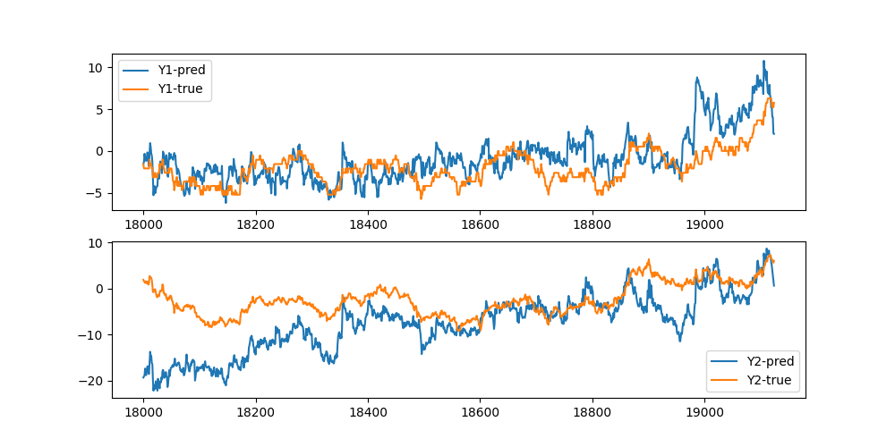

## Brief Answers to Questions
1. For feature selection, first QR-algorithm is used to get rid of linearly degenerate features. Then we use genetic algorithm to pick the best features. The genetic algorithm is followed by a greedy algorithm to find a smaller set of features. (See ***Feature Selection***)

2. We use linear regression with L2 regularization. First and second halves of a day are modeled with different linear regression.

3. After getting rid of NaN valued rows, all of the data is used. (See ***Data Pre-Processing***)

4. We employed 8-fold cross validation. The data is split into approximately equal sized parts across days. Each part is composed of consecutive days. We repeatedly train on 7 of these and test on 1 in a leave-one-out fashion. (See ***Linear Model***)

5. We provide out-of-sample $R^2$ metrics in **Results** section. A more detailed presentation os provided below. 

For reproducing the results see the very last section.

## Linear Model
We are minimizing MSE on the data denoted as $(X,y)$ with each time instance occupying a row in $X$ and $y$. 

$$\text{min}_{w} ||Xw - y||_2^2 + \lambda ||w||_2^2$$

Our feature selection algorithm learns feature selection mask $m$ and regularization parameter $\lambda$ jointly. For each $f = (m,\lambda)$ pair, we solve the normal equations on the train set. In order to keep $\lambda$ scale invariant across different cross validation runs, we multiply it with the maximum entry of $X^TX$ on the training set. Below we use subscript to indicate the corresponding submatrix or vector.

$$(X_m^TX_m+s_X\lambda I)w_{f} = X_m^Ty$$

$$s_X =\max_{i,j} (X^TX)_{i,j}$$

$$(X,y) = D_{\text{train}}$$

Then we acquire the mean squared error (MSE) value on the test set. 

$$\text{MSE}(f) = w_{f}^TX_m^TX_mw_{f} -  2w_{f}^TX_m^Ty + y^Ty,\quad (X,y) = D_{\text{test}}$$

The cross-validation is done by splitting the data into 8 approximately equal parts in time, i.e. a 1-7 split in test-train. The data is not shuffled before the split in order to avoid mixing any non-stationary nature of the data. The loss function is defined by averaging MSE on the test sets across all 8 splits. Below we index each of the 8 folds with $i$.

$$
\text{loss-fun}(f) =\big(\sum_{i = 0}^{n - 1} \text{MSE}(m,\lambda;i)\big)/\big(\sum_{i = 0}^{n - 1} \text{MSE}(0,\lambda;i)\big) + 
\epsilon (||m||_1 + \lambda)
$$

In the loss function the MSE values are normalized with $\sum_i\text{MSE}(0,\lambda;i)$ which is a constant equal to $y^Ty$, the total energy across the whole target values. The second part of the loss function is to promote reduction in the number of parameters and L2-regularization. The value of $\epsilon$ is chosen small, $10^{-4}$, so that this part only runs in effect when MSE is no longer decreasing significantly.

We use $R^2$ value from cross-valiation as the primary metric to understand how well the calibrations generalize. $R^2$ is defined by one minus the first part of the loss-fun.

$$
\text{R}^2(f) = 1 - \big(\sum_{i = 0}^{n - 1} \text{MSE}(m,\lambda;i)\big)/\big(\sum_{i = 0}^{n - 1} \text{MSE}(0,\lambda;i)\big)
$$

## Data Pre-Processing

We create different calibrations for different parts of the day. For this we experimented with 2 and 4 split of the day into equal parts. In our experiments, we see that 4 way split didn't create good generalization for second and third parts. We decided to use 2 way split for the whole project. 

In data cleaning, we get rid of rows with Q1,Q2 < 0.9999. We set any X and Y value with larger than 999 absolute value to NaN. Any row with a NaN on X or Y is removed. In total, we get rid of 7% of the data. 

## Feature Selection

The features are nearly linear-degenerate. In order to get rid of those which are linearly dependent on others, we run a QR-decomposition on $X^TX$. The zeros on R matrix diagonals emerge when prior columns of cancel out that column. We get rid of features that correspond to a diagonal value less than 1e-5 (relative to the largest diagonal value). This reduces the number of features from 375 to 233 and 238 (morning/afternoon separately). We continue our feature selection process with the remaining ones. 

We use the library [geneticalgorithm](https://github.com/rmsolgi/geneticalgorithm) in order to minimize the loss function. The algorithm starts with randomly a generated population of 1000 individuals. Each individual is a vector in the form of $(m,\log_{10}(\lambda))$. $m$ as an integer takes values from $\{0,1\}$ and $\log_{10}(\lambda) \in [-12,-1]$ is a real number. In each round random pairs are crossed to create 2 offsprings by splitting the sequence of numbers $(m,\log_{10}(\lambda))$ on a random point and crossing the values. At each round individual are selected according to their fitness and with a chance of $1/300$, an entry in an individual gets mutated. We stop the algorithm after 200 generations pass with no improvements on the best score. 

The genetic algorithm results are not necessarily optimal. We can improve it with a simple greedy algorithm. In this method, at each step we either change a single 1 entry in $m$ to 0 or reduce $\log_{10}(\lambda)$ by $0.5$. Among all possible decisions, we take the one that creates the largest drop in the loss. The iterations continue until the loss no longer can be reduced.

## Results

With linear models we observe the following out-of-sample $R^2$ values. 

 $R^2$ | Morning | Afternoon | 
--- | --- | --- | 
Y1|4.266e-03|4.916e-03|
Y2|4.705e-03|3.546e-03|

The number of the selected features vary between 25 and 35.

Y0-morning: X1,X5,X9,X14,X22,X24,X25,X34,X35,X88,X95,X105,X108,X109,X114,X115,X119,X121,X127,X139,X199,X212,X213,X311,X314,X316,X318,X319,X330,X331,X338,X348,X349

Y0-afternoon: X3,X4,X21,X40,X43,X51,X55,X70,X74,X86,X111,X114,X179,X190,X196,X201,X235,X239,X242,X309,X314,X315,X326,X327,X328

Y1-morning: X1,X5,X9,X10,X17,X20,X26,X69,X88,X99,X103,X108,X109,X113,X118,X119,X121,X128,X129,X139,X146,X199,X212,X224,X233,X242,X301,X311,X338,X348,X349

Y1-afternoon: X3,X4,X40,X53,X54,X55,X56,X71,X75,X80,X87,X99,X105,X109,X111,X114,X124,X128,X135,X190,X201,X204,X239,X309,X313,X314,X315,X319,X327,X328,X337


We further experimented with xgboost models. However, they scored around 1e-3 $R^2$ values. After using Bayesian optimization, the results didn't get better. This is reassuring as the performance is not suffering from a lack of complexity of a linear model. 

## Reproducing The Results

### Training
The repo assumes that the data is present in path `calibration.constants.PARQUET_DATA_PATH` points at as parquet files. Run the following line to generate normal equation matrices and save them to `calibration.constants.NORMAL_EQS_FOLDER` under the workspace. 

```
python calibration/normaleqs.py
```

To train the linear models, run the following line. This saves the results into `calibration.constants.GENETIC_SOLUTIONS_FOLDER`. While it runs, it will print the best scores achieved.

```
python calibration/genetic.py
```

The repo contains the already trained weights. If it all went well, you can run the demo to read $R^2$ values and see the selected features.

```
python calibration/demo.py
```



### Testing
We have 'LinearModel' class under 'calibration/test' which can be used as shown below to apply to a pandas dataframe.

```
df = pd.DataFrame(...) # must contain X1-375 ad Q1-2 columns
model = LinearModel()
ypred = df.apply(lm,axis = 1).compute() # Y1 and Y2 columns
ytrue = dfpart[['Y1','Y2']]
```

